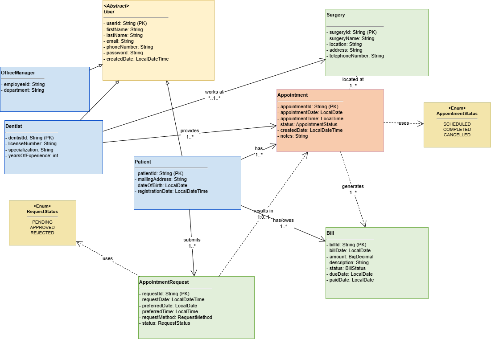
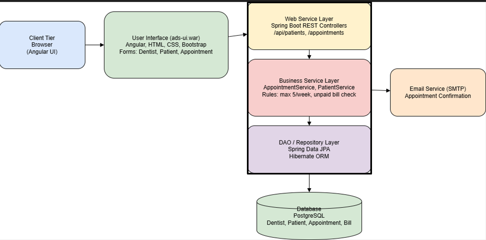
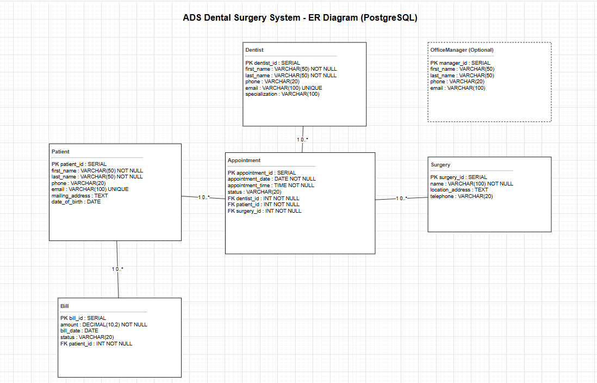

## Advantis Dental Surgeries System (ADS)
### Adisalem Hadush

## 1. Introduction
- This project designs a web-based system for managing dental surgery operations.
- The system supports Advantis Dental Surgeries (ADS), a network of clinics across multiple cities.
- The goal is to improve efficiency in managing dentists, patients, and appointments through a centralized platform.

## 2. Problem Statement
- ADS manages a growing network of dental surgeries and requires a scalable system to support its operations.
- Manual or fragmented processes make it difficult to:
  - Register and manage dentists and patients
  - Handle appointment scheduling efficiently
  - Ensure proper communication between patients and dentists
- There is a need for a web-based solution that:
  - Centralizes data management
  - Automates appointment booking and notifications
  - Enforces business rules (e.g., appointment limits, unpaid bills)
- The system must support multiple users with role-based access (Office Manager, Dentist, Patient).

## 3. Functional Requirements
### 3.1 Dentist Management
- Office Manager registers new dentists and records dentist details (ID, name, phone, email, specialization)
- Dentist signs in to the system
- Dentist views assigned appointments

### 3.2 Patient Management
- Office Manager enrolls new patients and records patient details (name, phone, email, address, date of birth)
- Patient signs in to the system
- Patient views their appointments

### 3.3 Appointment Management
- Patient requests appointment via online form or phone (handled by Office Manager)
- Office Manager receives appointment requests and books appointments for patients
- System records and stores appointments (date, time, patient, dentist, surgery)
- Patient views assigned dentist details
- Dentist views assigned appointments and patient details for scheduled visits
- Patient requests appointment cancellation or change (post-presentation fix)

### 3.4 Notifications
- Email appointment booking and cancellation notifications are a future improvement

### 3.5 Business Rules
- System enforces a maximum of 5 appointments per dentist per week
- Unpaid-bill checks and blocking are post-presentation fixes

### 3.6 Surgery Management
- System maintains surgery information (name, address, phone)
- System assigns appointments to specific surgery locations

## 4. Solution Overview
### 4.1 Static Model (UML Class Diagram)
- Key classes:
  - User
  - Role
  - UserRole
  - Dentist
  - Patient
  - Appointment
  - Surgery
  - Address

### 4.2 System Architecture
- Frontend UI for role-based workflows (Office Manager, Dentist, Patient) is planned
- REST API layer with validation and business rules
- Service layer for scheduling, billing checks, and notifications
- PostgreSQL database for persistent storage
- JWT-based authentication and role-based authorization

### 4.3 Database Design (ER Diagram)
- Main entities:
  - Users
  - Roles
  - UserRoles
  - Dentists
  - Patients
  - Appointments
  - Surgeries
  - Addresses
  

## 5. Conclusion
- ADS now has a centralized, role-based platform for dentists, patients, and office managers.
- Core workflows are supported end-to-end: registration, scheduling, and appointment management.
- Business rules and security are enforced through validation and role-based access.
- Containerized deployment will be completed and submitted by the deadline.
- Future improvements include a full frontend UI, online payments, email appointment booking and cancellation notifications, and smarter scheduling.
- Post-presentation fixes include unpaid-bill checks and appointment cancellation flows.

## 6. Demo

